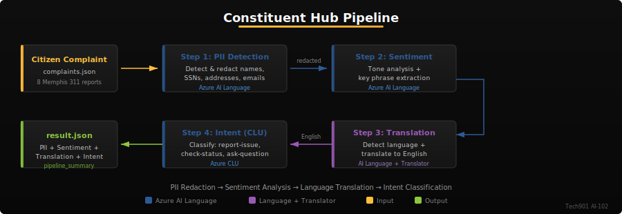
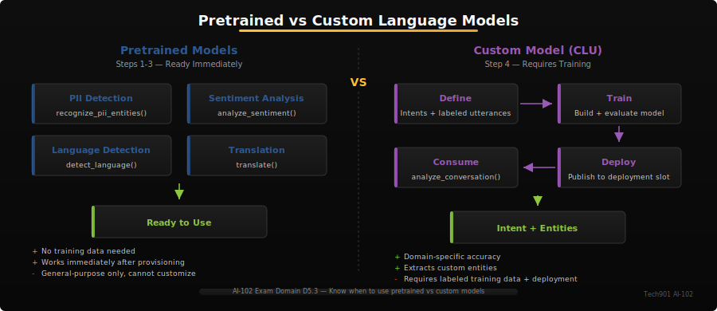
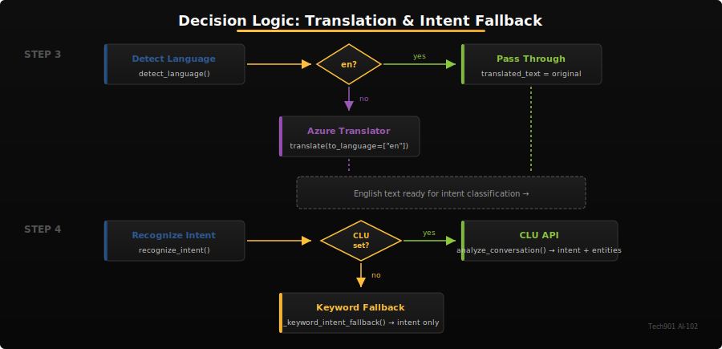

# Activity 5 - Constituent Services Hub

Memphis receives hundreds of citizen complaints daily — in multiple languages, containing sensitive personal information, with varying levels of urgency. Before these complaints can be routed to the right department, your platform needs to redact PII, understand the tone, translate non-English messages, and classify what the citizen actually needs. In this activity, you build a complete NLP pipeline using Azure AI Language services that processes real Memphis 311 complaints through four critical stages.

## Learning Objectives

By the end of this activity, you will be able to:

1. Detect and redact personally identifiable information (PII) from citizen text
2. Perform sentiment analysis and extract actionable key phrases
3. Detect the language of incoming text and translate non-English messages to English
4. Classify citizen intents using Conversational Language Understanding (CLU)
5. Chain multiple NLP services into a resilient processing pipeline
6. Handle multilingual input gracefully with fallback mechanisms

## Prerequisites

- Completed Activity 1 (Hello, Azure AI)
- Azure AI Language endpoint and key (provided as Codespaces secrets)
- Azure Translator key and region (provided as Codespaces secrets)
- CLU project deployed by instructor (for Step 4)

## Setup

1. Open this activity in GitHub Codespaces (or your local environment)
2. Copy `.env.example` to `.env` and fill in your credentials:

   ```bash
   cp .env.example .env
   ```

3. Install dependencies:

   ```bash
   pip install -r requirements.txt
   ```

4. Verify your environment variables are set:

   ```bash
   python -c "import dotenv; dotenv.load_dotenv(); import os; print('Language:', 'OK' if os.getenv('AZURE_AI_LANGUAGE_ENDPOINT') else 'MISSING')"
   ```

> [!NOTE]
> Steps 1-3 use the Azure AI Language service endpoint (`AZURE_AI_LANGUAGE_ENDPOINT`). Step 4 (CLU) uses the same endpoint but requires additional environment variables (`CLU_PROJECT_NAME`, `CLU_DEPLOYMENT_NAME`) that your instructor will provide after deploying the CLU model.

> [!TIP]
> **Pro Tip:** Test each pipeline step independently with a single complaint before running the full pipeline. Call each function in isolation (e.g., `detect_and_redact_pii("test text")`) to pinpoint which SDK call has a configuration issue. This saves significant debugging time compared to running `main.py` and parsing a wall of errors.

## Pipeline Overview



Your pipeline processes each complaint through four stages: PII redaction protects sensitive data before any other processing, sentiment analysis gauges urgency, translation ensures all complaints are in English, and intent classification routes the complaint to the right team.

## Project Structure

```
activity05-constituent-hub/
├── app/
│   └── main.py                  ← Your code goes here (4 TODO functions)
├── data/
│   ├── complaints.json          ← 10 Memphis 311 complaints (loaded by main.py)
│   └── intent_examples.json     ← CLU training reference (read-only)
├── tests/
│   └── test_basic.py            ← Visible self-check tests
├── diagrams/
│   ├── constituent-hub-pipeline.svg
│   ├── fallback-logic.svg
│   └── model-comparison.svg
├── .env.example                 ← Credential placeholders
├── requirements.txt             ← Python dependencies
├── REFLECTION.md                ← Reflection questions (submit with code)
└── README.md                    ← This guide
```

## Step 1: PII Detection and Redaction

Open `app/main.py` and implement `detect_and_redact_pii()`.

The Azure AI Language service can identify and redact personally identifiable information from text. This is the first step in the pipeline because **PII must be removed before sending text to any other service** — sentiment analysis, translation, and intent classification should all operate on sanitized text.

### How It Works

The `TextAnalyticsClient.recognize_pii_entities()` method accepts a list of text documents and returns results with:

- **`redacted_text`** — The original text with PII replaced by category labels (e.g., `"John Smith"` becomes `"***"`)
- **`entities`** — A list of detected PII items, each with `.text`, `.category`, and `.confidence_score`

### What to Implement

Follow the numbered TODO comments in `detect_and_redact_pii()`:

1. Get the Language client using `_get_language_client()`
2. Call `client.recognize_pii_entities([text])` — pass text as a single-item list
3. Extract `result.redacted_text` from the first response document
4. Build an entities list from `result.entities` with text, category, and confidence_score
5. Return a dict with `original_text`, `redacted_text`, and `entities`

> [!NOTE]
> **Production Note**: In a real system, you would **not** store `original_text` alongside `redacted_text` — that defeats the purpose of redaction. We include it here so you can compare before/after during development. In production, only `redacted_text` and entity metadata would be persisted.

> [!IMPORTANT]
> **Pretrained vs Custom Models**: PII detection, sentiment analysis, and key phrase extraction are all **pretrained** -- they work immediately with no training data. CLU (Step 4) is **custom** -- it requires you to define intents, add labeled utterances, train, and deploy before it works. The exam tests your ability to distinguish when to use each type.
>
> 

> [!IMPORTANT]
> **PII Categories**: The SDK detects many categories by default: `Person`, `Address`, `USSocialSecurityNumber`, `PhoneNumber`, `Email`, `Organization`, and more. You do not need to specify which categories to detect — the service finds all supported types automatically.

> [!WARNING]
> **Processing Order Matters**: Always redact PII **before** passing text to sentiment analysis or translation. If you skip this step, sensitive data like SSNs and names will be sent to other Azure services and may appear in logs.

### Code Hint

```python
response = client.recognize_pii_entities([text])
doc = response[0]
# doc.redacted_text contains the sanitized version
# doc.entities is a list of PiiEntity objects
```

> [!TIP]
> **Pro Tip:** The Language service batch API accepts up to 1,000 documents per call. For Memphis 311's daily volume, batching all complaints in one `recognize_pii_entities()` call is both faster and cheaper than processing them one at a time.

> [!NOTE]
> **Self-Check** (10 points)
> ```bash
> pytest tests/test_basic.py::test_pii_result_has_redacted_text -v
> pytest tests/test_basic.py::test_pii_result_has_entities -v
> pytest tests/test_basic.py::test_pii_entity_has_category -v
> ```

> [!TIP]
> **Stretch Goal**: Filter PII detection to specific categories using the `categories_filter` parameter. For example, detect only SSNs and phone numbers: `client.recognize_pii_entities([text], categories_filter=[PiiEntityCategory.US_SOCIAL_SECURITY_NUMBER, PiiEntityCategory.PHONE_NUMBER])`.

## Step 2: Sentiment Analysis and Key Phrase Extraction

Implement `analyze_sentiment_and_phrases()` in `app/main.py`.

This step makes two separate SDK calls on the **redacted** complaint text:

1. **Sentiment analysis** classifies the overall tone as `positive`, `negative`, `neutral`, or `mixed`
2. **Key phrase extraction** identifies actionable topics like `"broken streetlight"` or `"Beale Street"`

### How It Works

**Sentiment**: `client.analyze_sentiment([text])` returns a result with:
- `.sentiment` — Overall document sentiment (`"positive"`, `"negative"`, `"neutral"`, `"mixed"`)
- `.confidence_scores` — Object with `.positive`, `.negative`, `.neutral` float values (sum ≈ 1.0)

**Key phrases**: `client.extract_key_phrases([text])` returns a result with:
- `.key_phrases` — A list of extracted phrases like `["broken streetlight", "Beale Street"]`

### What to Implement

Follow the numbered TODO comments in `analyze_sentiment_and_phrases()`:

1. Get the Language client
2. Call `client.analyze_sentiment([text])` and extract sentiment + confidence scores
3. Call `client.extract_key_phrases([text])` and extract the phrases list
4. Build a confidence_scores dict: `{"positive": 0.01, "negative": 0.95, "neutral": 0.04}`
5. Return a dict with `sentiment`, `confidence_scores`, and `key_phrases`

> [!TIP]
> **Routing Use Case**: In a production 311 system, key phrases help route complaints to the right department. A complaint with phrases `["broken streetlight", "Beale Street"]` maps to Public Works, while `["loud music", "noise"]` maps to Code Enforcement. Sentiment helps prioritize — highly negative complaints may need faster response.

> [!TIP]
> **Key Insight:** Sentiment and key phrases together create a **priority matrix**. "Negative" sentiment + phrases like "flood" or "fire" = urgent. "Neutral" + "recycling schedule" = routine. Using two signals is more reliable than either alone — this is how production 311 systems prioritize without human review of every message.

> [!IMPORTANT]
> **Confidence Scores**: The three confidence values (positive, negative, neutral) always sum to approximately 1.0. A sentiment of `"mixed"` occurs when both positive and negative scores are significant.

> [!NOTE]
> **Self-Check** (10 points)
> ```bash
> pytest tests/test_basic.py::test_sentiment_has_valid_value -v
> pytest tests/test_basic.py::test_sentiment_has_confidence_scores -v
> pytest tests/test_basic.py::test_sentiment_has_key_phrases -v
> ```

> [!TIP]
> **Stretch Goal**: Enable opinion mining by passing `show_opinion_mining=True` to `analyze_sentiment()`. This extracts aspect-level sentiments like "streetlight: negative" or "response time: positive" from a single complaint.

## Step 3: Language Detection and Translation

Implement `detect_and_translate()` in `app/main.py`.

Memphis is a diverse city — complaints arrive in English, Spanish, Vietnamese, and other languages. This step detects the language and translates non-English text so the rest of the pipeline can process everything uniformly.



### How It Works

This step uses **two different clients**:

1. **Language detection** uses `TextAnalyticsClient.detect_language([text])`:
   - Returns `.primary_language.iso6391_name` (e.g., `"en"`, `"es"`, `"vi"`)
   - Returns `.primary_language.confidence_score` (float 0-1)

2. **Translation** uses `TextTranslationClient.translate()`:
   - Takes `body=[text]` (list of strings) and `to_language=["en"]`
   - Returns a list; the English translation is at `response[0].translations[0].text`

### What to Implement

Follow the numbered TODO comments in `detect_and_translate()`:

1. Get the Language client for detection
2. Call `client.detect_language([text])` and extract language code + confidence
3. If language is not `"en"`, get the Translator client using `_get_translator_client()`
4. Call `translator.translate(body=[text], to_language=["en"])` — body is a list of strings
5. Return a dict with `detected_language`, `confidence`, `original_text`, `translated_text`, and `was_translated`

For English text, set `translated_text` equal to `original_text` and `was_translated` to `False`.

> [!NOTE]
> **Different Credentials**: The Language service and Translator service use different API keys and clients. Language detection is part of `TextAnalyticsClient` (uses `AZURE_AI_LANGUAGE_KEY`), while translation uses `TextTranslationClient` (uses `AZURE_TRANSLATOR_KEY`). Make sure both are configured in your `.env` file.

> [!IMPORTANT]
> **Exam Tip:** The AI-102 exam tests which client handles what. Language detection = `TextAnalyticsClient` (Language service). Translation = `TextTranslationClient` (Translator service). They have separate endpoints, keys, and pricing tiers. If the exam asks "which service detects language?" the answer is **Language**, not Translator.

> [!WARNING]
> The Translator service also requires a **region** parameter (e.g., `"eastus"`). This is set via `AZURE_TRANSLATOR_REGION` in your `.env` file. If the region is wrong, translation calls will fail with a 401 error.

> [!NOTE]
> **Self-Check** (10 points)
> ```bash
> pytest tests/test_basic.py::test_translation_has_detected_language -v
> pytest tests/test_basic.py::test_translation_has_translated_text -v
> pytest tests/test_basic.py::test_translation_has_was_translated -v
> ```

> [!TIP]
> **Stretch Goal**: Translate complaints into multiple target languages by passing additional language codes: `to_language=["en", "es", "fr"]`. This could support multilingual response templates for the 311 system.

## Step 4: Intent Recognition with CLU

Implement `recognize_intent()` in `app/main.py`.

Conversational Language Understanding (CLU) is a custom NLP model trained to classify citizen messages into specific intents. Unlike the general-purpose services in Steps 1-3, CLU requires a **trained and deployed model** specific to your domain.

### The Three Intents

| Intent | Description | Example |
|--------|-------------|---------|
| `report-issue` | Citizen reporting a new problem | "There's a pothole on Poplar Avenue" |
| `check-status` | Asking about an existing complaint | "What's the status of my case?" |
| `ask-question` | Requesting general information | "Where do I find recycling schedules?" |

The CLU model also extracts **entities** like locations (`"Poplar Avenue"`), issue types (`"pothole"`), and case numbers (`"311-2025-044"`). See `data/intent_examples.json` for training examples.

### How It Works

The `ConversationAnalysisClient.analyze_conversation()` method takes a task dict:

```python
task = {
    "kind": "Conversation",
    "analysisInput": {
        "conversationItem": {
            "id": "1",
            "text": text,
            "participantId": "user",
        }
    },
    "parameters": {
        "projectName": clu_project,
        "deploymentName": clu_deployment,
        "stringIndexType": "TextElement_V8",
    },
}
```

The response contains `.result.prediction` with:
- `.top_intent` — The highest-confidence intent string
- `.intents` — List of intents with `.category` and `.confidence_score`
- `.entities` — List of extracted entities with `.category` and `.text`

### Intent Name Mapping

The CLU model uses PascalCase intent names (`ReportIssue`, `CheckStatus`, `GetInformation`) — this follows Azure naming conventions. However, this pipeline uses kebab-case (`report-issue`, `check-status`, `ask-question`) to match the keyword fallback and output contract. The `_CLU_INTENT_MAP` dict in `main.py` bridges the two conventions — use it to convert after extracting the raw intent from CLU.

### What to Implement

The `recognize_intent()` function already includes a fallback mechanism: if `CLU_PROJECT_NAME` or `CLU_DEPLOYMENT_NAME` environment variables are missing, it uses `_keyword_intent_fallback()` instead. Your job is to implement the CLU path inside the `try` block:

1. Get the CLU client using `_get_clu_client()`
2. Build the task dict (shown above) with project and deployment names from environment
3. Call `client.analyze_conversation(task)`
4. Extract top_intent from the response and **map it** using `_CLU_INTENT_MAP.get(raw_intent, raw_intent)`
5. Extract confidence and entities, return a dict with `top_intent`, `confidence`, and `entities`

> [!IMPORTANT]
> **Exam Connection (D5.3 -- Custom Language Models)**: Know the full CLU lifecycle for the exam: **create project** -> **define intents** -> **add labeled utterances** -> **train** -> **evaluate** (review precision/recall per intent) -> **deploy** -> **consume** via the prediction API. Also know the Custom Q&A workflow: create a knowledge base, add question-answer pairs, train, publish, and query.

> [!IMPORTANT]
> **Exam Connection (D5.2 -- Speech)**: Although this activity focuses on text, the exam tests Speech Services concepts: `SpeechRecognizer` (speech-to-text), `SpeechSynthesizer` (text-to-speech), **SSML** (Speech Synthesis Markup Language for controlling voice, pitch, and rate), and **speech translation** (real-time translation of spoken input). The stretch goal at the end of this activity introduces `SpeechSynthesizer`.

> [!IMPORTANT]
> **Instructor Deployment Required**: The CLU model must be trained and deployed before this step works. Your instructor will provide `CLU_PROJECT_NAME` and `CLU_DEPLOYMENT_NAME` values. Until then, the keyword fallback handles intent classification.

> [!IMPORTANT]
> **CLU Required for Full Credit**
> When CLU environment variables are configured (`CLU_PROJECT_NAME`, `CLU_DEPLOYMENT_NAME`),
> hidden tests will verify that your code uses the CLU API for intent classification.
> The keyword fallback is acceptable for local development, but the live CLU model
> must work for full autograding credit.

> [!NOTE]
> **CLU Lifecycle (AI-102 Exam Topic D5.3)**
>
> | Phase | What happens |
> |-------|-------------|
> | Define | Create intents, entities, and label utterances |
> | Train | Build and evaluate the language model |
> | Deploy | Publish to a named deployment slot |
> | Consume | Call the runtime API from your application |

> [!TIP]
> **Pro Tip:** The fallback pattern here (CLU → keyword matching) is a production best practice called **graceful degradation**. Always have a simpler backup when an AI service is unavailable. Memphis 311 can't stop accepting complaints during an Azure outage — the keyword fallback keeps the pipeline running at reduced accuracy.

> [!NOTE]
> **Fallback Mechanism**: The `_keyword_intent_fallback()` function uses simple keyword matching as a backup. Words like "report", "broken", "pothole", "water", "sewer" map to `report-issue`; "status", "update", "case" map to `check-status`; "where", "how", "information" map to `ask-question`. This ensures the pipeline produces output even without CLU.

> [!NOTE]
> **Self-Check** (10 points)
> ```bash
> pytest tests/test_basic.py::test_intent_has_top_intent -v
> pytest tests/test_basic.py::test_intent_has_valid_values -v
> pytest tests/test_basic.py::test_intent_has_confidence -v
> ```

## Step 5: Run the Full Pipeline

With all four functions implemented, the `main()` function will:

1. Load complaints from `data/complaints.json` (10 Memphis 311 complaints)
2. Run each complaint through PII detection → sentiment analysis → translation → intent recognition
3. Track progress with status indicators (✓/⏭/✗)
4. Generate `result.json` with all outputs and a `pipeline_summary`

Run the pipeline:

```bash
python app/main.py
```

> [!TIP]
> If you see an error like `python: can't open file 'app/main.py'`, you are in the wrong directory. `cd` into the folder that contains `app/` and `tests/`, then try again.

You should see output like:

```
--- Step 1: PII Detection and Redaction ---
  ✓ Complaint 1: 3 PII entities redacted
  ✓ Complaint 2: 0 PII entities redacted
  ...

--- Step 2: Sentiment Analysis and Key Phrases ---
  ✓ Complaint 1: negative sentiment
  ...

Pipeline complete: 4/4 steps (success)
Result written to result.json
```

The `pipeline_summary` in your output tracks overall statistics:

```json
{
  "total_complaints": 10,
  "steps_completed": ["pii_detection", "sentiment_analysis", "translation", "intent_recognition"],
  "pii_entities_found": 9,
  "languages_detected": ["en", "es", "vi"],
  "translations_performed": 2
}
```

> [!NOTE]
> **Checkpoint:** Before running all visible tests, verify your `result.json`: (1) all 4 sections present (`pii_results`, `sentiment_results`, `translation_results`, `intent_results`), (2) at least some PII entities were found, (3) at least one complaint was translated, (4) all intents are one of `report-issue`, `check-status`, or `ask-question`.

> [!NOTE]
> **Self-Check** (10 points)
> ```bash
> pytest tests/test_basic.py::test_pipeline_summary_exists -v
> pytest tests/test_basic.py::test_pipeline_summary_total -v
> ```

> [!TIP]
> **Stretch Goal — Speech Synthesis**: Use the Azure Speech SDK to convert translated complaints into spoken audio. This could power a phone-based 311 response system that reads complaint status updates aloud. Install with `pip install azure-cognitiveservices-speech` and explore `speechsdk.SpeechSynthesizer`.

## Running and Submitting

### Run all visible tests

```bash
pytest tests/ -v
```

### Expected output files

| File | Description |
|------|-------------|
| `result.json` | Pipeline output with PII, sentiment, translation, intent results |

### Submit your work

```bash
git add app/ REFLECTION.md
git commit -m "Complete Activity 5 - Constituent Services Hub"
git push
```

> [!WARNING]
> Make sure your script can generate `result.json` (run `python app/main.py` at least once). The autograder runs hidden tests against the output file created by your code.

## Grading

| Category | Weight | What It Measures |
|----------|--------|-----------------|
| Correctness | 40% | PII redacted, sentiments correct, translations accurate, intents classified |
| Robustness | 25% | Handles edge cases: empty text, long text, already-English, ambiguous intent |
| Safety | 20% | No hardcoded keys, PII not leaked in output, lazy client initialization |
| Code Quality | 15% | Clean output contracts, proper error handling, fallback mechanisms |

> [!TIP]
> **Pro Tip:** The Safety category (20%) checks two things most students miss: **lazy client initialization** (never create SDK clients at module level) and **PII containment** (redacted text in outputs, not originals). Quick check: search your `main.py` for any client creation outside a function — if you find one, wrap it in the lazy init pattern from Activity 1.

> [!IMPORTANT]
> **Exam Note (D5.2)**: The AI-102 exam covers speech-to-text and text-to-speech with Azure Speech Services. This activity focuses on text analysis and translation. Study speech processing in Chapter 7 of the textbook.

> [!NOTE]
> **Production Readiness -- Secret Rotation**: In Activity 2, you compared key-based auth, RBAC, and managed identity. In production, key-based auth requires periodic **secret rotation** -- regenerating API keys and updating all consumers. RBAC with managed identity eliminates this entirely because Azure handles credential lifecycle automatically. This is why production deployments prefer managed identity.

**Reflection**: Complete `REFLECTION.md` with thoughtful responses to earn full participation credit.

## Troubleshooting

| Error | Cause | Fix |
|-------|-------|-----|
| `401 Unauthorized` | Wrong API key or region mismatch | Check that you're using the correct key (Language vs Translator). For Translator, also verify `AZURE_TRANSLATOR_REGION` matches your resource's actual region |
| `InvalidArgument: text is empty` | Sending empty string to PII detection | Ensure `complaint_texts` list is populated before Step 1 |
| `404 Not Found` (CLU) | Wrong project or deployment name | Verify `CLU_PROJECT_NAME` and `CLU_DEPLOYMENT_NAME` in `.env` |
| `Translator region mismatch` | Region doesn't match key | Set `AZURE_TRANSLATOR_REGION` to match your resource region |

## Key Concepts

| Term | Definition |
|------|-----------|
| **PII Redaction** | Identifying and replacing personally identifiable information (names, SSNs, addresses) with placeholder text to protect privacy |
| **Sentiment Analysis** | Classifying text as positive, negative, neutral, or mixed based on emotional tone |
| **Key Phrases** | Automatically extracted terms that represent the main topics of a document |
| **Language Detection** | Identifying which language a text is written in, with a confidence score |
| **Translation** | Converting text from one language to another using neural machine translation |
| **CLU (Conversational Language Understanding)** | A custom NLP model trained to classify user intents and extract domain-specific entities |
| **Intents** | Categories representing what a user wants to do (report-issue, check-status, ask-question) |
| **Entities** | Specific information extracted from text (locations, issue types, case numbers) |
| **Lazy Initialization** | Creating SDK clients only when first needed, not at module import time |
| **Pipeline Summary** | Aggregate statistics about pipeline execution (steps completed, entities found, translations performed) |
